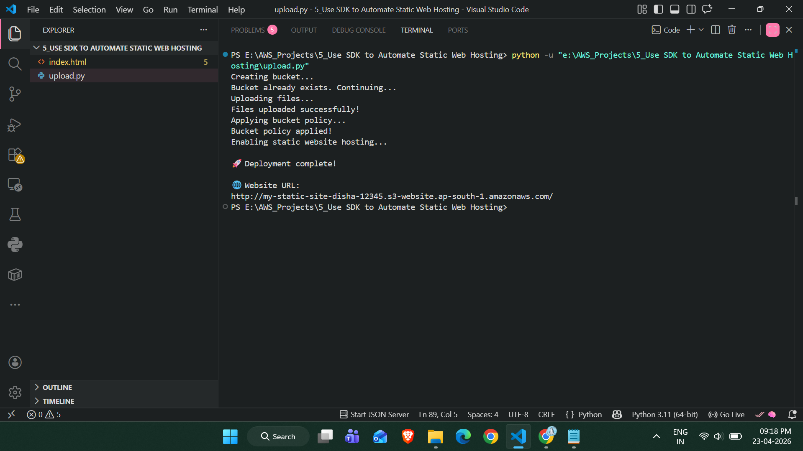
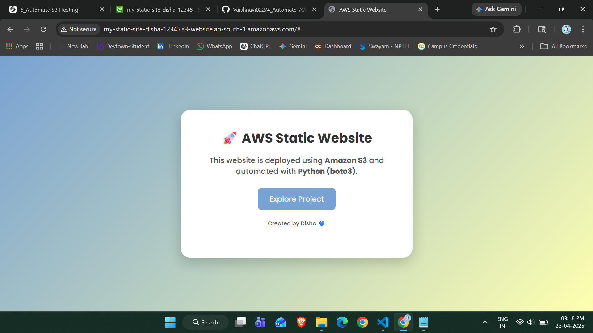

# 🚀 Automate Static Website Hosting on AWS S3 using Python (boto3)

## 📌 Project Overview

This project demonstrates how to automate the deployment of a static website on AWS S3 using Python and boto3 (AWS SDK).

The script performs the complete setup:

* Creates an S3 bucket
* Uploads website files
* Applies bucket policy
* Enables static website hosting

---

## 🎯 Objective

To eliminate manual deployment steps and automate static website hosting using Python.

---

## 🧰 Technologies Used

* Python
* boto3 (AWS SDK)
* AWS S3

---

## 📁 Project Structure

```
5_Use_SDK_to_Automate_Static_Web_Hosting/
│
├── index.html
├── upload.py
├── requirements.txt
├── images/
│   ├── terminal-output.png
│   ├── final-output.png
│   └── placeholder.txt
```

---

## ⚙️ Setup Instructions

### 1️⃣ Install Dependencies

```
pip install boto3
```

---

### 2️⃣ Configure AWS Credentials

```
aws configure
```

Enter:

* AWS Access Key
* AWS Secret Key
* Region (ap-south-1)

---

### 3️⃣ Run the Script

```
python upload.py
```

---

## 🔄 Workflow

1. Create S3 bucket
2. Upload HTML/CSS files
3. Apply public bucket policy
4. Enable static website hosting
5. Generate website URL

---

## 📸 Project Screenshots

### 🖥️ Terminal Output



### 🌐 Final Website Output



---

## 🌍 Final Output

🔗 Website URL:

```
http://my-static-site-disha-12345.s3-website-ap-south-1.amazonaws.com/
```

---

## ⚠️ Important Notes

* Disable "Block Public Access" in S3 bucket
* Ensure `index.html` exists
* Bucket name must be globally unique

---

## 🧠 Key Learnings

* AWS S3 static hosting
* Automation using boto3
* IAM permissions and bucket policies
* Debugging real AWS errors

---

## 🚀 Future Enhancements

* Add CloudFront (CDN + HTTPS)
* CI/CD using GitHub Actions
* Multi-page website support

---

## 👩‍💻 Author
Vaishnavi Chaudhari 

